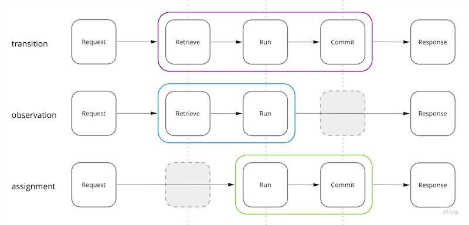

# Operations

An operation expresses one piece of a component's behavior: discount an order, read its status,
calculate a price, or ask billing to make a charge. Its declaration describes the contract;
its function expresses the business rule. The runtime validates the request, supplies the state
and context, and persists changes according to the operation's type.

## Retrieve, run, commit

An operation has three phases. Its type determines which of them it needs:

1. **Retrieve** — acquire the state the function will work with: an object, a group of objects,
   or a stream of objects.
2. **Run** — execute the business function with input, the supplied state, and context.
3. **Commit** — validate and persist the changes made by the function.



The frame separates the operation from its request and response. The empty positions show phases
an operation type does not have. A transition uses all three; an observation does not commit;
an assignment prepares changes without retrieving state first.

The function expresses the **run** phase. Retrieval and persistence belong to the runtime.
Changing several fields in the function prepares one state change; it does not save each field
as a separate write.

**Commit is one transaction.** All changes prepared during Run are applied together. If Run
returns a business rejection, Commit does not happen and no transaction is opened. A failure
during Commit leaves none of the changes applied. This also holds when a transition changes a
group of objects: the group is committed as one unit.

For example, an operation can change both an order's status and its total. Other calls see the
committed result with both changes, rather than an intermediate order with only one of them.
The function does not begin, commit, or roll back transactions itself.

Retrieve and commit are optional. An observation retrieves state and runs without committing;
a computation only runs. A transition retrieves or initializes state, runs, and commits.
An assignment prepares a changeset without giving the function the current state, then commits it.

This gives operations their **safe** or **unsafe** character. Observations and computations are
safe: they do not change business state. Transitions and assignments are unsafe and have a commit
phase. An effect is also unsafe because of the interaction it performs, but does not commit the
state supplied to its function.

The transaction contains only the operation's own managed state and the events produced by its
change. Retrieve and Run happen before it. Calling another operation does not bring that
operation's changes into the same transaction. A payment already charged by billing is not undone
if the order's commit fails.

## The contract

Consider an operation that discounts a pending order. Its input is a percentage, its output is
the new total, and it can reject an order that is no longer pending:

```yaml
# manifest.toa.yaml
operations:
  discount:
    description: Apply a percentage discount to a pending order.
    input:
      type: object
      properties:
        percent: { type: number, minimum: 0, maximum: 100 }
      required: [percent]
    output:
      type: integer
      minimum: 0
    errors: [NOT_PENDING]
    concurrency: retry
```

The input schema makes the accepted values explicit. A request without `percent`, or with a
percentage outside the declared range, is rejected before the function runs. The operation can
concentrate on the business rule:

```typescript
export async function transition (input: DiscountInput, object: Order) {
  if (object.status !== 'pending')
    return new Error('NOT_PENDING')

  object.total = Math.round(object.total * (1 - input.percent / 100))

  return object.total
}
```

Here, totals are integer amounts in the smallest currency unit. The function changes the order
and returns its new total. Those are two separate parts of its contract: the changed object is
state to persist, and the returned number is the reply to the caller.

The operation's name is `discount`; the exported name `transition` identifies its type. The type
tells the runtime how the function uses state. The same component can contain operations of
different types.

## Calling an operation

A call separates the business input from the selection of state:

```typescript
const total = await context.remote.orders.discount({
  input: { percent: 10 },
  query: { id: order.id }
})
```

`input` carries what the function needs to do its work. `query` identifies the order to work on.
The function receives the selected order as its second argument, so it does not need to load it
or interpret the query. Calls within the component use `context.local.discount` with the same
request shape.

The reply is either the new total or the declared `NOT_PENDING` rejection. An invalid request,
a missing order, or an unexpected failure is an exception rather than a business reply.

`output` describes the successful reply. During local development the runtime also checks replies
against the declared output and errors, helping catch an implementation that breaks its contract.

## Concurrent changes and retries

Another call may change the order between retrieval and commit. With `concurrency: retry`, the
runtime retrieves the current order and runs the function again. The pending-state check and
the discount calculation therefore both run against that newer state. A retry can still fail;
it does not guarantee that the call will eventually succeed.

The function must be suitable for repeated execution. In particular, charging a payment inside
this transition could charge it again when the transition retries. Calls to other components
are not rolled back when this component's commit fails.

## Choosing an operation type

| Type | What the function works with | What it does |
| --- | --- | --- |
| `transition` | Current state, or a new object | Changes state using business rules |
| `observation` | Current state | Returns a read-only view |
| `assignment` | A changeset | Assigns values without reading current state into the function |
| `computation` | Input | Calculates a result without state or side effects |
| `effect` | Input and context, optionally current state | Performs an interaction without committing changes to the supplied state |

### Transition: change state

Use a transition when a change depends on what is already stored. The discount operation needs
the current status and total; approving an order similarly checks its status before changing it:

```typescript
export async function transition (input, object: Order) {
  if (object.status !== 'pending')
    return new Error('NOT_PENDING')

  object.status = 'approved'
}
```

Modify the supplied object to change state. Returning another object does not replace that state;
it supplies a reply. A transition may also succeed without returning a value, as approval does
here.

A transition called without a query starts with a new object. The function fills in the fields
required by the entity schema before it can be persisted. A transition can also work with a group
of objects; those state scopes are covered in [State and Entities](state.md).

### Observation: read state

An observation answers a question about state:

```typescript
export async function observation (input, object: Order) {
  return object.status
}
```

It returns a result and does not persist changes. Treat the supplied state as read-only. For an
ordinary order lookup that finds no object, the call returns `null` without running the function.

Use observations for individual records, lists, and views derived from them. The query determines
which state is supplied; the operation determines what the caller gets back.

### Assignment: set values

An assignment receives a changeset to fill, rather than the current order:

```typescript
export async function assignment (input: SetTotalInput, changeset: Partial<Order>) {
  changeset.total = input.total
}
```

The runtime applies those fields to the selected object, leaving other fields unchanged. If the
function returns no explicit reply, an assignment returns the resulting state.

Use this when the desired value is already known. Setting an imported total is an assignment;
reducing the existing total by ten percent is a transition. A changeset cannot tell the function
whether the order is pending or what its previous total was.

Assignments still go through the runtime's state handling and can produce declared events.
They are not direct database writes.

### Computation: calculate from input

A computation has no entity state. It calculates a result from its input:

```typescript
export async function computation (input: LineItem) {
  return input.price * input.quantity
}
```

The input and output schemas describe this contract just as they do for a stateful operation.
Use a computation for calculations that need no stored entity and produce no side effects.

### Effect: perform an interaction

An effect expresses work whose purpose is an interaction, such as asking another component to
charge an order:

```typescript
export async function effect (input: ChargeInput, context: Context) {
  return context.remote.billing.charge({ input })
}
```

It uses the context to reach the other component. It can also receive state for reference, but
changes to that supplied state are not committed. Use a transition when this component's own
state must change.

An effect does not create a transaction across components. The target defines its own contract,
and the caller must account for a rejected or repeated charge. Any business errors returned to
the effect's caller must be part of the effect's own declared contract too.

## Safe and unsafe operations

**Safe** operations observe or calculate without changing the business state of the system:
`observation` and `computation`.

**Unsafe** operations can change it: `transition`, `assignment`, and `effect`. An effect belongs
here even when it only reads its own component's state, because the interaction it performs may
change something elsewhere.

This distinction describes the work a call can do. A read operation must not hide a write behind
a remote call. Conversely, an unsafe operation is not necessarily unsafe to repeat: setting a
status to the same value may have no further effect, while applying another percentage discount
does. Repeated delivery and business idempotency must be considered separately from the type.

## Genuine operations

The runtime can take responsibility for execution because the function follows a few rules.
Toa calls an operation that follows them *genuine*:

- **Stateless.** Keep no business state between calls. An order's history belongs in its entity,
  not in a module variable that only one process can see.
- **Deterministic.** Given the same input and state, make the same business decision. When a rule
  depends on a time or a generated value, make that value part of the data the operation receives.
- **Autonomous.** Depend on the supplied context rather than assuming a particular host, database
  connection, or deployment layout.
- **Pure.** Express changes through the supplied state and interactions through context. Keep
  direct I/O out of the business function, and use a type appropriate to any interaction it makes.
- **Non-exceptional.** Return declared business rejections as values. Reserve thrown exceptions
  for unexpected failures, rather than using them as business control flow.

For example, `NOT_PENDING` is an expected outcome of discounting an order. It belongs in `errors`
and is returned with `new Error('NOT_PENDING')`. A failed storage connection is an execution
failure; it is not another possible discount result.

These rules do not make every sequence of operations transactional or every repeated call harmless.
They keep each operation's behavior explicit so the runtime can manage its execution and the
application can define how separate business steps fit together.

## Unmanaged reads

Some queries need a storage capability that the regular operation model does not expose.
An `unmanaged` operation gives the function direct access to its component's storage client.

This is a deliberate departure from the model: the query depends on the chosen storage, and the
function is responsible for handling the records it reads, including filtering out deleted ones.
Use it for specialized reads. Do not write or physically delete records through that client:
those writes bypass the runtime's concurrency control, state validation, and events.

Prefer an observation when the regular query model can express the read. Use transitions or
assignments for changes, so the component's state remains managed by the runtime.

---

Next: [State and Entities](state.md) — what an operation's state represents and how it changes.
