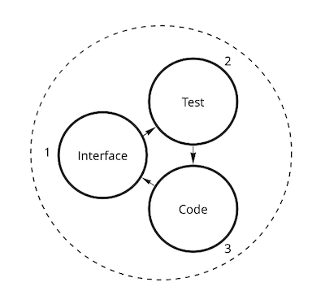

# Development Requirements

## Unit of Work

[TDD](https://en.wikipedia.org/wiki/Test-driven_development) is considered to be the way (but
not guarantee) to create *non-broken software*. Minimal developer's unit of work is one
iteration of TDD cycle.

Considering this project
uses [JavaScript with DTS](https://www.typescriptlang.org/docs/handbook/declaration-files/templates/module-d-ts.html)
contributor's unit of work is:

<picture>
<source media="(prefers-color-scheme: dark)" srcset="unit-dark.png">

</picture>

## Flow

This project
follows [GitHub's standard forking model](https://guides.github.com/activities/forking/).

## Code Style Requirements [](https://standardjs.com)

This project follows [JavaScript Standard Style](https://standardjs.com).

```shell
$ npm run lint
```

## Commits

### Commit Granularity

Small commits are [better](https://gitforteams.com/resources/commit-granularity.html) than big ones.

If you find yourself confused when you should commit changes, imagine you have a permanent question
from your boss: **What have you done?** Then, each time you have a reasonable answer to it, you
should commit. And that answer should be
your commit message (in the form conforming to commit message convention).

### Commit Messages [](https://conventionalcommits.org)

Please use [Conventional Commits](https://www.conventionalcommits.org/en/v1.0.0/).

Commit subject line should complete the sentence:
> If applied, this commit will `[add your subject line here]`

