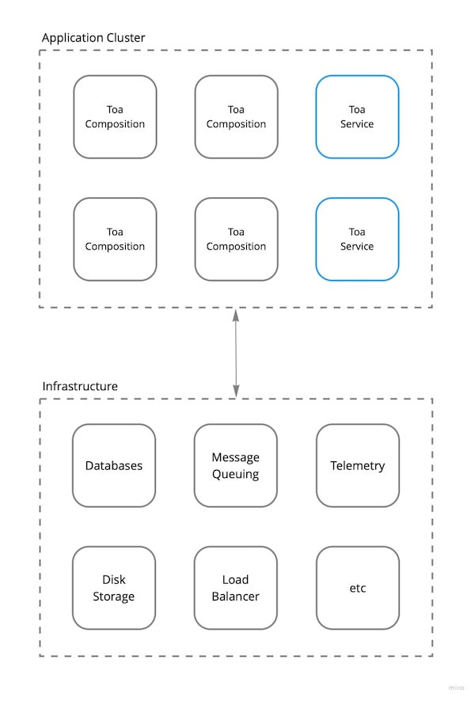

# Deployment Design

## TL;DR

<a href="https://miro.com/app/board/uXjVOoy0ImU=/?moveToWidget=3458764528998857282&cot=14">
    <picture>
        <source media="(prefers-color-scheme: dark)" srcset="./.deployment/deployment-dark.jpg">
        
    </picture>
</a>

## Several processes of one context on shared infrastructure

Every process of a context names what it keeps after its scope: the context's name, followed by
`TOA_SUFFIX` where one is given. Processes given different suffixes run beside each other against one
MongoDB, one pair of brokers on one virtual host and one Redis, and see nothing of each other — a
local copy of an application started next to another one, say.

```shell
$ TOA_SUFFIX=-agent-0a1b2c3d4e5f toa compose ./components/*
```

| where    | without a suffix                         | with one                                          |
| -------- | ---------------------------------------- | ------------------------------------------------- |
| MongoDB  | the database `app`                       | the database `app-agent-0a1b2c3d4e5f`             |
| AMQP     | `<namespace>.<component>.<endpoint>`, …  | `app-agent-0a1b2c3d4e5f.<namespace>.<component>.<endpoint>`, … |
| Redis    | `app:<namespace>:<component>:<key>`, …   | `app-agent-0a1b2c3d4e5f:<namespace>:<component>:<key>`, … |

- **Nothing is put between the context and the suffix**, so a suffix begins with whatever separator
  you want. `app` with `1a` and `app1` with `a` are one scope and share everything.
- **Letters, digits and hyphens.** A suffix holding anything else, or nothing, fails the boot.
- **63 bytes in all.** A MongoDB database name is no longer than that, so a context and suffix that
  add up to more fail the boot of a component with storage.
- **Read as the process boots**, from its environment or its `.env`. Setting `process.env.TOA_SUFFIX`
  afterwards changes what the processes it starts are given, and nothing of its own.
- **Not everything is scoped.** `comq.retry.*` and `comq.parked` are shared by every process on a
  broker, the queue a process's replies arrive on is `comq.reply..<random id>`, and what an extension
  keeps elsewhere — the files of `storages`, a federation upstream of
  `convergence` — is named as it is configured.
- **A copy starts empty.** Its database, its queues and its keys are its own, so it has none of the
  data of the processes it runs beside.
