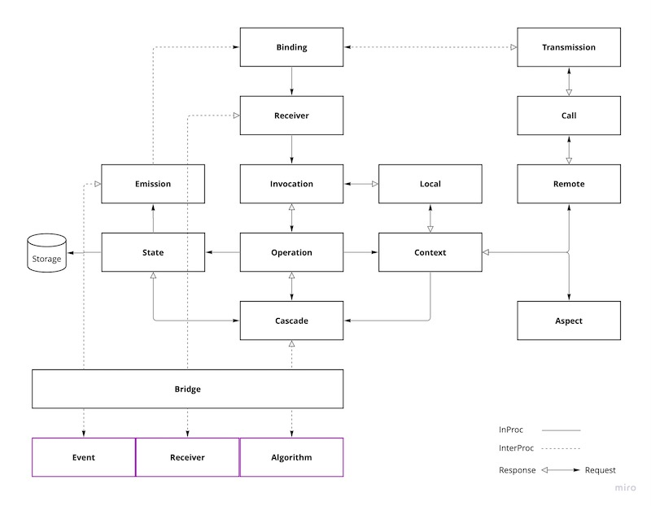
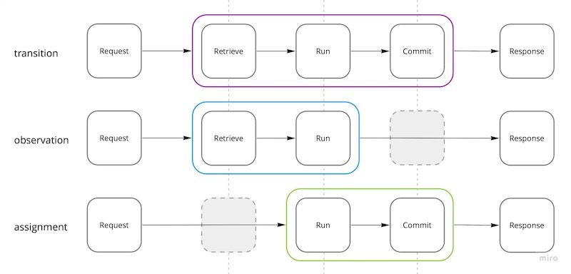

# System Design

## TL;DR

<a href="https://miro.com/app/board/uXjVOoy0ImU=/?moveToWidget=3458764528920876193&cot=14">
    <picture>
        
    </picture>
</a>

---

## Introduction

## Operations

Operations are execution units, a fundamental building block of the distributed system. Operation's
algorithm is an entry point for an application developer.

### Types

Operations have three phases: *Retrieve* - acquire the current state, *run* - execute algorithm, and
*commit* - store the new state.

Retrieve or commit phases may be optional depending on operation's type.

<a href="https://miro.com/app/board/uXjVOoy0ImU=/?moveToWidget=3458764528922779666&cot=14">
    <picture>
        
    </picture>
</a>

Retrieve phase provides the Scope, which is the current state of the Entity Object, or a set of
Entity Objects, or a stream of Entity Objects.

#### Transition

Operates on the current state of the Entity Object, allowing for modifications to be made. Once the
Transition algorithm is completed, the new modified state is persisted to the Storage.

#### Observation

Operates on the current state of the Entity Object without allowing any modifications.

#### Assignment

Operates on the Changeset, allowing modifications to be made. After the Assignment algorithm is
completed, the Entity Object is updated in the Storage.

### Special Types

#### Computation

Operation that neither use the Scope nor produce side effects.

#### Effect

Special case of the Observation (unsafe Observation) that optionally uses the Scope and produces
side effects.

If the Effect is called with `entity` property of the Request, the current state will be acquired
using atomic "get or create."

#### Unmanaged

Unmanaged operations have direct access to the underlying client of the Storage.

```javascript
// MongoDB Storage
async function unmanaged (input, collection, context) {
  return await collection.findOne({ id: input.id })
}
```

> Unmanaged operations lack concurrency control, events, object identification, versioning,
> timestamps and other features provided by the runtime.

### Safety

Operations are categorized into two types based on their impact on the State: *safe* and *unsafe*.
Safe operations don't modify the State, while unsafe operations do.

| Operation   | Safety |
|-------------|--------|
| Transition  | Unsafe |
| Observation | Safe   |
| Assignment  | Unsafe |
| Computation | Safe   |
| Effect      | Unsafe |

### Genuine Operations

Operation algorithm must be:

1. **Stateless.** Results of running N operation instances 1 time each must be the same as result of
   running 1 operation instance N times.
2. **Deterministic**. Gives the same output when it has the same input.
3. **Autonomous.** Doesn't impose requirements on the execution environment (i.e. network access).
4. **Pure.** Doesn't produce side effects. Therefore, the only effects allowed are Context
   interactions and updates to the State.
5. **Non-exceptional**. Doesn't use exceptions for control flow.

### Declaration

Operations are declared in component's manifest file with `operations` object whose keys are
operation names (*endpoints*) and values as an operation declaration object.

<dl>
<dt></dt>
<dd></dd>
</dl>

#### Example

```yaml
# manifest.toa.yaml
operations:
  add:
    type: transition
    concurrency: retry
    input:
      sender: id
      text: string
      timestamp: integer
    output:
      id: id
    queryable: false
```

### Algorithm Example

```javascript
// Node.js Bridge
async function transition (input, entity, context) {
  const price = context.configuration.price
  const request = { input: price, query: { id: input.sender } }
  const reply = await context.remote.credits.balance.debit(request)

  if (reply instanceof Error)
    return reply

  Object.assign(entity, input)

  return { output: { id: entity.id } }
}
```
