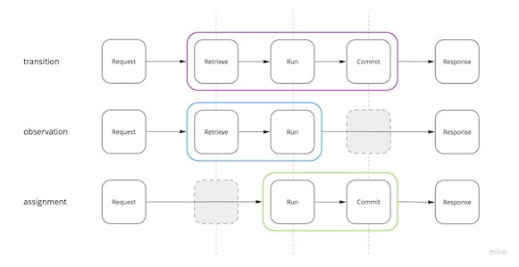

# System Design

## TL;DR

<a href="https://miro.com/app/board/uXjVOoy0ImU=/?moveToWidget=3458764528920876193&cot=14">
    <picture>
        <source media="(prefers-color-scheme: dark)" srcset="./.design/design-dark.jpg">
        
    </picture>
</a>
---

## Introduction

## Operation

Operations are execution units, a fundamental building block of the distributed system. Operation's
algorithm is an entry point for an application developer.

### Types

Operations have three phases: *retrieve* - get current state using *query*, *run* - execute
algorithm, and *commit* - store new state.

Retrieve or commit phases may be optional depending on operation's type.

<a href="https://miro.com/app/board/uXjVOoy0ImU=/?moveToWidget=3458764528922779666&cot=14">
    <picture>
        <source media="(prefers-color-scheme: dark)" srcset="./.design/operation-dark.jpg">
        
    </picture>
</a>

### Declaration

Operations are declared in component's manifest file with `operations` object whose keys are
operation names (*endpoints*) and values as operation declaration object.

<dl>
<dt></dt>
<dd></dd>
</dl>

Example:

```yaml
# component.toa.yaml
operations:
  add:
    type: transition
    concurrency: retry
    input:
      sender: id
      text: string
      timestamp: integer
    output:
      id: id
    queryable: false
```

### Algorithm

Example:

```javascript
// operations/add.js
/**
 * Stores a message. Debits senders's balance for each one.
 */
async function transition (input, entity, context) {
  const price = context.configuration.price
  const request = { input: price, query: { id: input.sender } }
  const reply = await context.remote.credits.balance.debit(request)

  if (reply.error) return { error: reply.error }

  Object.assign(entity, input)

  return { output: { id: entity.id } }
}
```

### Genuine Operations

1. **Stateless.** Results of running N operation instances 1 time each must be the same as result of
   running 1 operation instance N times.
2. **Deterministic**. Gives the same response when it has the same arguments.
3. **Autonomous.** Doesn't impose requirements on the execution environment (i.e. network access).
4. **Pure.** Doesn't produce side effects, therefore the only effect of the operation must be an
   updated state.
5. **Non-exceptional**. Doesn't use exceptions for control flow.

> <br/>
> Writing non-genuine operations is **strongly not recommended**, as they may result in exceptions
> or
> system logical problems.

## Component

Microservices are [known](https://en.wikipedia.org/wiki/Microservices) to be organized around
business capabilities and independently deployable.
