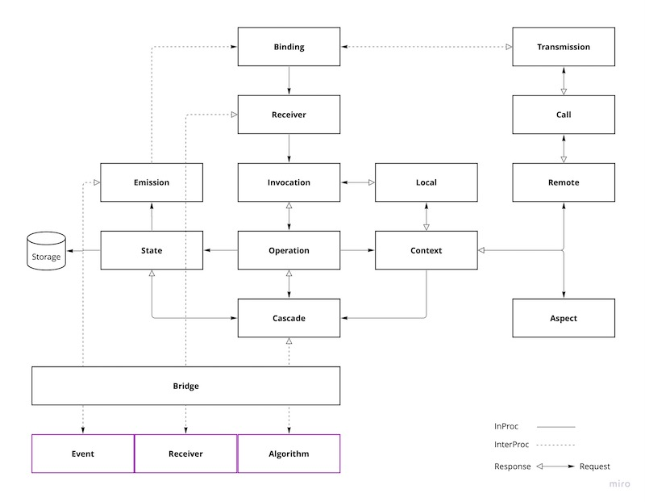

# System Design

## TL;DR

<a href="https://miro.com/app/board/uXjVOoy0ImU=/?moveToWidget=3458764528920876193&cot=14">
    <picture>
        
    </picture>
</a>

---

## Introduction

The runtime aims to make complicated things simple. Every choice exposed to users requires them to
understand the problem behind it, adding complexity even when the choice itself looks small. The
runtime therefore makes some decisions on their behalf, including cases where several options are
reasonable and none is clearly superior. These decisions are not necessarily the only correct ones;
making them is part of the runtime's responsibility to keep that complexity from becoming the user's
responsibility.

## Operations

Operations are execution units, a fundamental building block of the distributed system. Operation's
algorithm is an entry point for an application developer.

### Types

Operations have three phases: _Retrieve_ - acquire the current state, _run_ - execute algorithm, and
_commit_ - store the new state.

Retrieve or commit phases may be optional depending on operation's type.

<a href="https://miro.com/app/board/uXjVOoy0ImU=/?moveToWidget=3458764528922779666&cot=14">
    <picture>
        
    </picture>
</a>

Retrieve phase provides the Scope, which is the current state of the Entity Object, or a set of
Entity Objects, or a stream of Entity Objects.

#### Transition

Operates on the current state of the Entity Object, allowing for modifications to be made. Once the
Transition algorithm is completed, the new modified state is persisted to the Storage.

#### Observation

Operates on the current state of the Entity Object without allowing any modifications.

#### Assignment

Operates on the Changeset, allowing modifications to be made. After the Assignment algorithm is
completed, the Entity Object is updated in the Storage.

### Special Types

#### Computation

Operation that neither use the Scope nor produce side effects.

#### Effect

Special case of the Observation (unsafe Observation) that optionally uses the Scope and produces
side effects.

If the Effect is called with `entity` property of the Request, the current state will be acquired
using atomic "get or create."

#### Unmanaged

Unmanaged operations have direct access to the underlying client of the Storage.

```javascript
// MongoDB Storage
async function unmanaged(input, collection, context) {
  return await collection.findOne({ id: input.id })
}
```

> Unmanaged operations lack concurrency control, events, object identification, versioning,
> timestamps, [cross-region replication](/extensions/convergence) and other features provided by the
> runtime.

**An unmanaged operation reads. It never writes.** Everything the runtime provides is what a
write depends on, so a write made here is a write without a version to guard it, without the
timestamps the rest of the system reads, without an identifier the runtime issued, and without
the event that tells anything it happened — which is also what would have carried it to another
region. Use a Transition for one object, a Transition over `objects` for many, and an Assignment
for a changeset.

**Nothing removes a record.** Deletion is a `DELETED` timestamp, which every query filters on,
so a removed entity stops being found while what it was survives — the prototype's `terminate`
is that write. A record taken out of the collection takes its history with it, and leaves
anything that referred to it pointing at nothing.

### Safety

Operations are categorized into two types based on their impact on the State: _safe_ and _unsafe_.
Safe operations cannot modify the State; unsafe operations may, whether or not a given call does.

| Operation   | Safety |
| ----------- | ------ |
| Transition  | Unsafe |
| Observation | Safe   |
| Assignment  | Unsafe |
| Computation | Safe   |
| Effect      | Unsafe |
| Unmanaged   | Unsafe |

An Unmanaged operation is given the driver's own handle, so the rule it is held to above is the
author's to keep rather than the runtime's to enforce, and the runtime does not vouch for it.

A request may state that it only reads, and a call to an unsafe operation made under one is refused.
See [readonly chains](/documentation/readonly.md).

### Genuine Operations

Operation algorithm must be:

1. **Stateless.** Results of running N operation instances 1 time each must be the same as result of
   running 1 operation instance N times. An operation declared
   [`stateful`](/documentation/stateful.md) is served by every process under an address of its own,
   and is called on one of them by name.
2. **Deterministic**. Gives the same output when it has the same input.
3. **Autonomous.** Doesn't impose requirements on the execution environment (i.e. network access).
4. **Pure.** Doesn't produce side effects. Therefore, the only effects allowed are Context
   interactions and updates to the State.
5. **Non-exceptional**. Doesn't use exceptions for control flow.

### Declaration

Operations are declared in component's manifest file with `operations` object whose keys are
operation names (_endpoints_) and values as an operation declaration object.

<dl>
<dt></dt>
<dd></dd>
</dl>

#### Example

```yaml
# manifest.toa.yaml
operations:
  add:
    type: transition
    concurrency: retry
    input:
      sender: id
      text: string
      timestamp: integer
    output:
      id: id
    queryable: false
```

### Algorithm Example

```javascript
// Node.js Bridge
async function transition(input, entity, context) {
  const price = context.configuration.price

  const reply = await context.remote.credits.balance.debit({
    input: { price },
    query: { id: input.senderId }
  })

  if (reply instanceof Error) return reply

  Object.assign(entity, input)

  return entity
}
```
