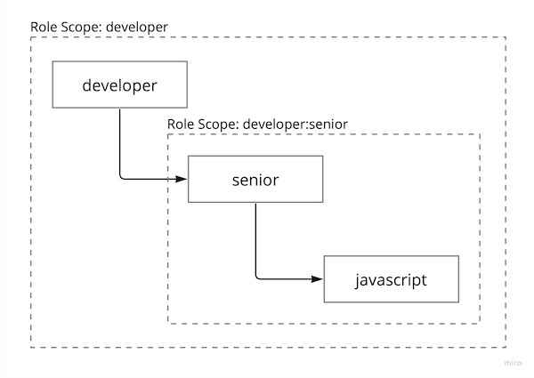

# Access authorization

> The Authorization is intrinsically linked with the [Authentication](./identity.md).

<a href="">
  <picture>
    <source media="(prefers-color-scheme: dark)" srcset="./.assets/ia3-dark.jpg">
    
  </picture>
</a>

## Directives

The Authorization is implemented as a set of [RTD Directives](../readme.md#directives).

Directives are executed in a predetermined order until one of them grants access to a resource. If none of the
directives grants access, then the Authorization interrupts request processing and responds with an authorization error.

### `anonymous`

Grants access if its value is `true` and the Identity is `null`, meaning that no credentials were provided.

### `id`

Grants access if resolved Identity matches the value of the URL path segment placeholder named after the directive's
value.

#### Example

Given the Route declaration and corresponding HTTP request:

```yaml
# context.toa.yaml

exposition:
  /users/:user-id:
    id: "user-id"
```

```http
GET /users/87480f2bd88048518c529d7957475ecd
Authorization: ...
```

For this request access will be granted if the resolved Identity value is `87480f2bd88048518c529d7957475ecd`.

### `role`

Grants access if resolved Identity has a role matching the directive's value or one of its values.

#### Example

```yaml
# context.toa.yaml

exposition:
  /code:
    role:
      - developer
      - reviewer
```

Access will be granted if the resolved Identity has a role that matches `developer` or `reviewer`.

Read [Roles](#roles) for more details.

### `rule`

The Rule is a collection of authorization directives. It allows access only if all the specified directives grant
access. The value of the `rule` directive can be a single Rule or a list of Rules.

#### Example

```yaml
# context.toa.yaml

exposition:
  /commits/:user-id:
    rule:
      id: user-id
      role: developer
```

Access will be granted if an Identity matches a `user-id` placeholder and has a Role of `developer`.

## Roles

Role values are strings that can be assigned to an Identity and used for matching with values of
the [`role` directive](#role).

### Hierarchy

Role values are alphanumeric tokens separated by a colon (:).
Each token defines a Role Scope, forming a hierarchy.
A Role matches the value of the `rule` directive if that Role has the specified Scope in a directive.

#### Example

```yaml
# context.toa.yaml

/exposition:
  /commits/:user-id:
    role: developer:senior
```

The example above defines a `role` directive with the specified `developer:senior` Role Scope.
This directive matches the roles `developer:senior` and `developer`,
but it **does not** match the Role `developer:senior:javascript`.
In other words, the Identity must have a specified or more general role.

<a href="https://miro.com/app/board/uXjVOoy0ImU=/?moveToWidget=3458764556008550471&cot=14">
  <picture>
    <source media="(prefers-color-scheme: dark)" srcset=".assets/role-scopes-dark.jpg">
    
  </picture>
</a>


> The root-level Role Scope `system` is preserved and cannot be used with the `role` directives.

### Resources

Roles are persistent, so the Authorization includes `identity.roles` Component, that exposes the following resources:

#### `/.identity/roles/:id`

<dl>
<dt><code>POST</code></dt>
<dd>Attach a role to an Identity. Request body is as follows:</dd>
</dl>

```yaml
role: string
```

<dl>
<dt><code>GET</code></dt>
<dd>Get a list of Roles, attached to an Identity.</dd>
<dt><code>PUT</code></dt>
<dd>Replace Roles attached to an Identity. Request body is as follows:</dd>
</dl>

```yaml
roles: [string]
```

#### `/.identity/roles/:id/:role`

<dl>
<dt><code>DELETE</code></dt>
<dd>Detach a Role from an Indetity.</dd>
</dl>
