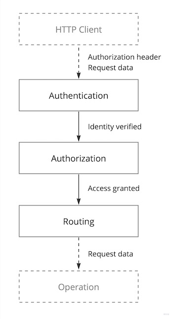

# Identity Authentication and Access Authorization Framework

## Concept

<a href="https://miro.com/app/board/uXjVOoy0ImU=/?moveToWidget=3458764555919725830&cot=14">
  <picture>
    <source media="(prefers-color-scheme: dark)" srcset="./.ia3/overview-dark.jpg">
    
  </picture>
</a>

## Identity

Identity is the fundamental entity within an authentication system that represents the **unique identifier** of an
individual, organization, application or device.

## Authentication

In order to prove its Identity, the request originator must provide a valid _credentials_ that are associated with that
Identity.

Identity is intrinsically linked to credentials, as an Identity is established only when the first set of credentials
for that Identity is created.
In other words, the creation of credentials marks the inception of an Identity.
Without credentials, there is no basis for defining or asserting an Identity.

Credentials are passed as a value of the `Authorization` HTTP header using one of the supported authentication schemes.

### Basic scheme

Classic ID/password pair authentication. See [RFC7617](https://datatracker.ietf.org/doc/html/rfc7617).

```http
Authorization: Basic aGVsbG86d29ybGQK
```

### Token scheme

Own tokens issued by the Authentication layer. The tokens are [PASETO](https://paseto.io).

The `Token` is the primary authentication scheme.
If request originators use an alternative authentication scheme, they will receive a response containing
`Token` credentials and will be required to switch to the `Token` scheme for any subsequent requests.
Continued use of other authentication schemes will result in temporary blocking of requests.

```http
Authrization: Token v4.local.eyJzdWIiOiJqb2hu...
```

### Bearer scheme

OpenID tokens issued by trusted providers.
For more information, refer to [OpenID Connect Core 1.0](https://openid.net/specs/openid-connect-core-1_0.html),
[RFC6750](https://datatracker.ietf.org/doc/html/rfc6750).

Trusted providers are specified using the `oidc.trust` property within the Exposition annotation.

```yaml
exposition:
  oidc:
    trust:
      - https://accounts.google.com
      - https://appleid.apple.com
```

The example above demonstrates the default list of trusted providers.

## Components

| Component           | Description                                          |
|---------------------|------------------------------------------------------|
| `identity.basic`    | Basic authentication credentials                     |
| `identity.subjects` | OpenID/OAuth token subjects connected to an Identity |
| `identity.roles`    | Roles for the `role` Directive.                      |
