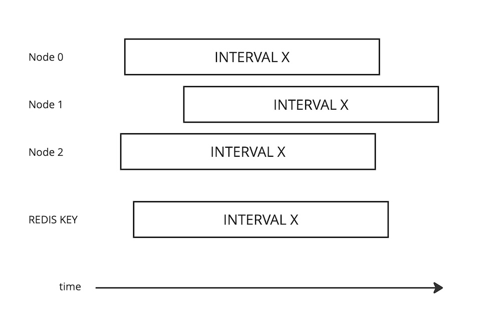

# Simple Decentralized Request Throttling

## Problem

To prevent an unnecessary load, API requests should be throttled when made maliciously or due to an
error.

## Context

1. The [API Gateway](https://microservices.io/patterns/apigateway.html) of a distributed system runs
   in multiple instances, each with an in-memory state that does not allow tracking the current
   quota usage.
2. Precise quota enforcement (per request, per second) is not critical; the goal is to prevent
   significant overuse.

## Forces

1. An additional round trip to fetch the current quota state for each request (centralized
   throttling) is unacceptable.
2. In a distributed system, there is no concept of a *global current time*.
3. Failure to retrieve the quota state should not result in Gateway failure.

## Solution

Implement in-memory quotas in each process, periodically synchronizing them asynchronously using
Redis.

Consider a basic throttling rule:

1. No more than `MAX_REQUESTS` within `INTERVAL` time for any API route (`KEY`).
2. If the limit is exceeded, block requests to `KEY` for `COOLDOWN` seconds.

### Concept

1. Divide `INTERVAL` into `N` spans (`N >= 2`).
2. At the end of each span,
   atomically increment the value in Redis ([INCRBY](https://redis.io/docs/latest/commands/incrby/))
   by the number of requests received for each `KEY`, using a key composed of the `KEY` and the
   current ordinal number of `INTERVAL`
   in [Unix epoch](https://en.wikipedia.org/wiki/Unix_time).
3. If the returned value exceeds `MAX_REQUESTS`, block access to `KEY`, remove after `COOLDOWN`.
4. If the write operation fails and `REQUESTS > MAX_REQUESTS / N` (i.e., the quota is exceeded
   locally), block access to `KEY`, remove after `COOLDOWN`.[^1]

[^1]: Point 4 can be improved by estimating the approximate number of active API Gateway instances
(`nodes`) based on previous records. In this case, compare `REQUESTS * nodes > MAX_REQUESTS / N`.

Each API Gateway instance will generate the `KEY` based on its own local time,
which, in general, will lead to simultaneous writes (from Redis’s local time perspective) to
different `KEY`s. However, the total contribution of each node to each `KEY` will correspond to the
actual request rate experienced by that node.

Dividing the `INTERVAL` into spans smooths the desynchronization effect.

### Caveats

1. In worst case scenario, the quota is exceeded by `MAX_REQUESTS / N` in a span on each node.
2. Time desynchronization between nodes is not significant for the selected `INTERVAL` (i.e.,
   `INTERVAL` >> desync).
