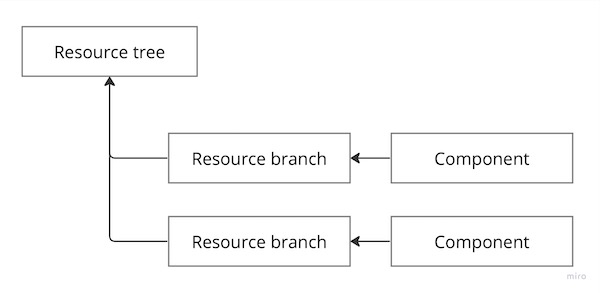

# Toa Exposition

## TL;DR

Exposition is a converter from [ROA](https://en.wikipedia.org/wiki/Resource-oriented_architecture)
to [SOA](https://en.wikipedia.org/wiki/Service-oriented_architecture).

```yaml
# manifest.toa.yaml

name: dummy
namespace: dummies

exposition:
  /:
    GET: observe
```

```yaml
# context.toa.yaml

exposition:
  host: api.example.com
```

```http
GET /dummies/dummy/
Host: api.example.com
```

See [features](features) for more examples.

## Overview

<a href="https://miro.com/app/board/uXjVOoy0ImU=/?moveToWidget=3458764555658883997&cot=14">
    <picture>
        <source media="(prefers-color-scheme: dark)" srcset="./documentation/.assets/overview-dark.jpg">
        
    </picture>
</a>

The Exposition extension includes a Service which is an HTTP server with ingress and a Tenant. The
Service communicates
with Tenants to discover their resource declarations and exposes them as HTTP resources. An instance
of the Tenant is
running within each Composition that has at least one Component with a resource declaration.

## Resource tree discovery

During the startup of the Tenant instance, it broadcasts an `expose` message
containing [Resource branches](#resource-branch)
of the Components within the Composition. Upon receiving the `expose` message, instances of the
Service (re-)configures
corresponding routes for its HTTP server.

During the startup of the Service instance, it broadcasts a `ping` message. Once an instance of the
Tenant receives
a `ping` message, it broadcasts an `expose` message.

## Resource branch

<a href="">
  <picture>
    <source media="(prefers-color-scheme: dark)" srcset="documentation/.assets/rtd-dark.jpg">
    
  </picture>
</a>

A Component can specify how to expose its Operations as HTTP resources by declaring a Resource
branch using the manifest extension.

```yaml
# manifest.toa.yaml

extensions:
  '@toa.io/extensions.exposition': ...
```

Alternatively, a shortcut `exposition` is available:

```yaml
# manifest.toa.yaml

exposition: ...
```

Resource branches are attached to a Tree with a prefix `/{namespace}/{name}` or `/{name}` for
components within the default namespace.

```yaml
# manifest.toa.yaml

name: rooms
namespace: messaging

exposition:
  /: ...
  /:user-id: ...
  /:user-id/:room-id: ...
```

The declaration above will result in exposing the following resources:

```
/messaging/rooms/
/messaging/rooms/:user-id/
/messaging/rooms/:user-id/:room-id/
```

> Trailing slash is required.

## Context annotation

The Exposition annotation declares options for its deployment.

```yaml
annotations:
  '@toa.io/extensions.exposition':
    host: the.exmaple.com
```

A shortcut is also available.

```yaml
exposition:
  host: the.example.com
```

| Option        | Type      | Description                                                      |
|---------------|-----------|------------------------------------------------------------------|
| `host`        | `string`  | Domain name to be used for the corresponding Kubernetes Ingress. |
| `class`       | `string`  | Ingress class                                                    |
| `annotations` | `object`  | Ingress annotations                                              |
| `debug`       | `boolean` | Output server errors. Default `false`.                           |

### Context resources

Exposition annotaion can contain [resource declaration](documentation/tree.md) under the `/` key.

```yaml
# context.toa.yaml

exposition:
  host: the.example.com
  /:
    /code:
      GET:
        endpoint: development.code.checkout
        type: observation
```

In the example above, a request `GET /code` will be mapped to the `development.code.checkout`
operation call.
Unlike a component resource branch declaration, properties `namespace`, `component`, and `type` are
required.

If component resource branch conflicts with an annotation, the annotation takes precedence.

### Example

```yaml
exposition:
  host: the.example.com
  host@staging: the.example.dev
  class: alb
  annotations:
    alb.ingress.kubernetes.io/scheme: internet-facing
    alb.ingress.kubernetes.io/target-type: ip
    alb.ingress.kubernetes.io/listen-ports: '[{"HTTPS": 443}]'
  /:
    /foo:
      GET: foo.bar.observe
```

## See Also

- [Protocol support](documentation/protocol.md)
- [Resource Tree Definition](documentation/tree.md)
- [Identity authentication](documentation/identity.md)
- [Access authorization](documentation/access.md)
- [Features](features)
