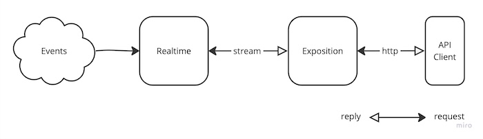

# Toa Realtime

## Overview

<a href="https://miro.com/app/board/uXjVOoy0ImU=/?moveToWidget=3458764566111478378&cot=14">
  <picture>
    <source media="(prefers-color-scheme: dark)" srcset=".readme/overview-dark.jpg">
    
  </picture>
</a>

Realtime extension combines application events into streams according to defined routes.
Clients may consume these streams [via Exposition](/extensions/exposition).

If stream is idle for 16 seconds, a `heartbeat` message is sent.

## Static routes

Static route specifies an event that should be combined into a stream using specified property of
event's payload as a stream key or an array of stream keys.

Static routes may be defined in Component manifest or the Context annotation.

```yaml
# manifest.toa.yaml

name: users

realtime:
  updated: id
```

```yaml
# context.toa.yaml

realtime:
  users.updated: id
  orders.created: customer_id
```

In case of conflict, the Context annotation takes precedence.

Multiple stream keys may be defined for a single event.

```yaml
# manifest.toa.yaml
name: messages

realtime:
  updated: [sender_id, recipient_id]
```

### Static route examples

Given two rules: `users.updated: id` and `orders.created: customer_id`,
the following events will be routed into a stream with `a4b8e7e8` key:

```yaml
# users.updated
id: a4b8e7e8 # id property is used as a stream key
name: John Doe
```

```yaml
# orders.created
id: 1
customer_id: a4b8e7e8 # customer_id property is used as a stream key
amount: 100
```

## Dynamic routes

A dynamic route is created at runtime: _this_ event, where _this_ property has _this_ value, goes to
_that_ stream. It delivers an event to an identity the event does not name — a moderator watching a
room, an operator watching any record.

### Declaring

An event is routed dynamically only where it is declared so, with the most a dynamic route of it
may expose. A route of an event not declared is refused.

```yaml
# manifest.toa.yaml
name: messages

realtime:
  created:
    key: [sender, recipient] # optional: a dynamic event needs no static key
    dynamic:
      expose: [id, room, text, sender]
```

`dynamic: true` allows a route to expose the whole payload.

### Creating a route

`realtime.streams.route` creates a route, and `realtime.streams.unroute` removes it.

```javascript
await context.remote.realtime.streams.route({
  input: {
    event: 'default.messages.created',
    property: 'room', // optional: without it, every event of its kind
    value: 'general',
    stream: 'a4b8e7e8',
    expose: ['id', 'text'] // optional, within the declaration
  }
})
```

An event matches where its `property` equals `value`, or is an array that contains it. A route is its
`event`, `property`, `value` and `stream`: creating it again changes nothing.

`route` is refused with:

- `NOT_DYNAMIC` — the event is not declared dynamic;
- `EXPOSE` — `expose` names a property the declaration does not allow.

> :warning:<br/>
> A route is not an authorisation: it routes any declared event to any stream. Call `route` behind
> a route of your own that decides who may watch what.

### Lifetime

A route lives while its stream is consumed, and `expire` seconds after the last consumer left — the
window in which a consumer reconnects with its token. A client that goes away without removing its
routes leaves nothing behind, so a client creates them again whenever it opens its stream without a
token.

### Example

A moderator watches a room. The stream is their own, and the application decides who may route a
room onto it:

```yaml
# rooms/manifest.toa.yaml
exposition:
  /:room/watchers/:identity:
    auth:rule: { id: identity, role: moderator }
    PUT: watch
    DELETE: unwatch
```

```javascript
// rooms/operations/watch.js
export async function effect(input, context) {
  await context.remote.realtime.streams.route({
    input: {
      event: 'default.messages.created',
      property: 'room',
      value: input.room,
      stream: input.identity
    }
  })
}
```

The client:

1. opens its stream, `GET /realtime/streams/a4b8e7e8/`;
2. watches the room, `PUT /rooms/general/watchers/a4b8e7e8/`;
3. receives every message created in `general` on its stream;
4. stops watching with `DELETE /rooms/general/watchers/a4b8e7e8/`, or by going away.

## Exposition

Streams are exposed by the [`realtime.streams`](components/realtime.streams) component, running in the
Realtime extension, and are
accessible via the `/realtime/streams/:key/` resource with
the [`auth:id: key`](/extensions/exposition/documentation/access.md#id) authorization rule.

Opening a stream is not a read, and `GET` is the method a client opens one with, so the route
declares [`io:readonly: false`](/extensions/exposition/documentation/io.md#readonly).

A key may be consumed by several clients at once — the same user on two devices, or in two
tabs. Each of them receives every event routed to the key, and one of them disconnecting leaves
the others connected.

Refer to the [Exposition extension](/extensions/exposition) for more details:

- [Multipart responses](/extensions/exposition/documentation/protocol.md#multipart-types)
- [Access authorization](/extensions/exposition/documentation/access.md)
- [Readonly chains](/documentation/readonly.md)

## Resources management

Resource requests and limits can be specified by `resources` annotation:

```yaml
# context.toa.yaml

realtime:
  resources:
    cpu: [100m, 500m]
    memory: [100Mi, 200Mi]
```
